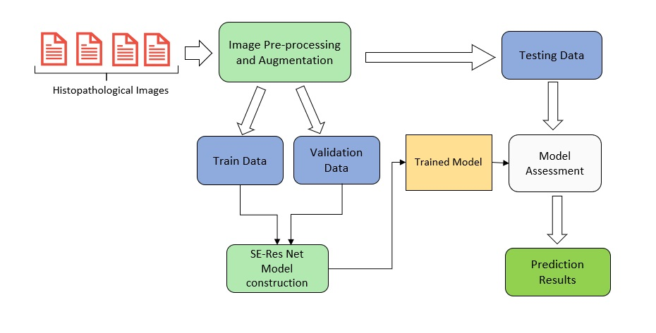
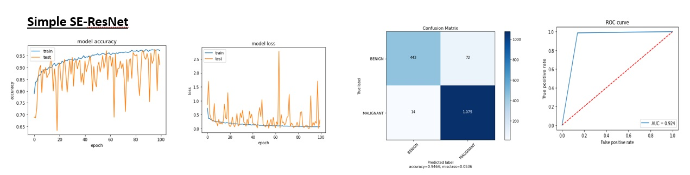
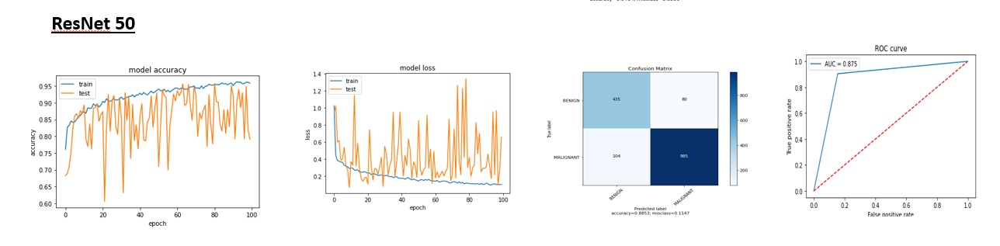
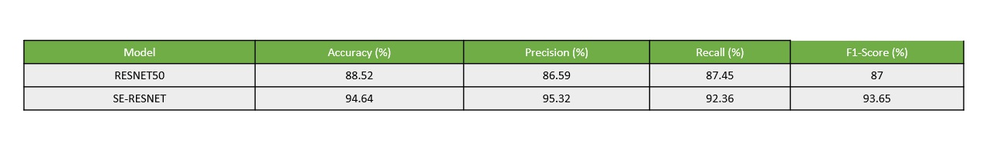

# BeatCancer
Breast Cancer Classification using CNN
Breast cancer develops from the breast tissue and shows different signs such as lumps, change in shape, changes in the texture of skin and pains in some cases. The detection of breast cancer happens through Mammography, ultrasound, analysing tissues, Biopsy and more methods. Each method has its unique way of identification and prone to manual mistakes. The usage of technology in classifying breast cancer improves diagnostic efficiency. The problem of classifying cancer can be done with the histopathology datasets, which is the accurate way of detecting it. 
In this project, the breast cancer classification of benign or malignant is carried out with the help of convolutional neural networks with simple SE-ResNet Model. The approach proposed in this work utilises CNN to extract features of histopathological images and classify the images into benign tumours and malignant tumours. 

## Residual Networks
Residual network gets added as a shortcut connection to the main path. For Identity mapping, the layers are added, and the other layers are derived from the learned model. Residual blocks with the shortcut connection enable to learn an identity function. These facilitate no impact on the training set because of the additional residual blocks getting stacked up

## Squeeze and Excitation Networks
SE-ResNet is built upon the convolution operation, which extracts informative features by fusing spatial and channel-wise information within local receptive fields.
SE proposed a weighted representation on a layer rather an equal representation. By learning the corresponding weights of each channel in the SE-block, it introduces an addition hyperparameter, r (ratio) to be used. For c number of channels, it attempts to learn a (sigmoidal) vector of size c (a tensor of 1x1xc to be exact) and multiplies it with the current tensor in the given layer.

<ins><b>Solution Approach</b></ins>

### Results
<ins><b>SE Resnet</b></ins>

<ins><b>Resnet50</b></ins>

<ins><b>Results Summary</b></ins>

### References

[1]Centres for Disease Control and Prevention, https://www.cdc.gov/cancer/breast/basic_info/what-is-breast-cancer.htm [Accessed May 2020]
[2]International Agency for Research on Cancer (IARC) and World Health Organization (WHO), https://gco.iarc.fr/ [Accessed May 2020]
[3]Cancer Research UK, https://www.cancerresearchuk.org/health-professional/cancer-statistics/statistics-by-cancer-type/breast-cancer [ Accessed May 2020]
[4]F. A. Spanhol, L. S. Oliveira, C. Petitjean and L. Heutte, "A Dataset for Breast Cancer Histopathological Image Classification," in IEEE Transactions on Biomedical Engineering, vol. 63, no. 7, pp. 1455-1462, July 2016, doi: 10.1109/TBME.2015.2496264.
[5]K. Liu, G. Kang, N. Zhang and B. Hou, "Breast Cancer Classification Based on Fully-Connected Layer First Convolutional Neural Networks," in IEEE Access, vol. 6, pp. 23722-23732, 2018, doi: 10.1109/ACCESS.2018.2817593.
[6]X. Li, M. Radulovic, K. Kanjer and K. N. Plataniotis, "Discriminative Pattern Mining for Breast Cancer Histopathology Image Classification via Fully Convolutional Autoencoder," in IEEE Access, vol. 7, pp. 36433-36445, 2019, doi: 10.1109/ACCESS.2019.2904245.
[7]Jiang Y, Chen L, Zhang H, Xiao X (2019) Breast cancer histopathological image classification using convolutional neural networks with small SE-ResNet module. PLoS ONE 14(3): e0214587. https://doi.org/10.1371/journal.pone.0214587
[8]K. He, X. Zhang, S. Ren and J. Sun, "Deep Residual Learning for Image Recognition," 2016 IEEE Conference on Computer Vision and Pattern Recognition (CVPR), Las Vegas, NV, 2016, pp. 770-778, doi: 10.1109/CVPR.2016.90
[9]J. Hu, L. Shen, S. Albanie, G. Sun and E. Wu, "Squeeze-and-Excitation Networks," in IEEE Transactions on Pattern Analysis and Machine Intelligence, doi: 10.1109/TPAMI.2019.2913372.
[10]X. Zhong, O. Gong, W. Huang, L. Li and H. Xia, "Squeeze-and-Excitation Wide Residual Networks in Image Classification," 2019 IEEE International Conference on Image Processing (ICIP), Taipei, Taiwan, 2019, pp. 395-399, doi: 10.1109/ICIP.2019.8803000.
[11]Mesut Toğaçar, Kutsal Baran Özkurt, Burhan Ergen, Zafer Cömert, BreastNet: A novel convolutional neural network model through histopathological images for the diagnosis of breast cancer, Physica A: Statistical Mechanics and its Applications, Volume
545,2020,123592,ISSN 0378-4371,https://doi.org/10.1016/j.physa.2019.123592. https://github.com/Goodsea/BreastNet [Accessed May 2020]
[12] ImageNet, http://image-net.org/challenges/talks_2017/SENet.pdf [Accessed May 2020]

