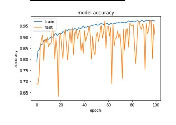

# BeatCancer
Breast Cancer Classification using CNN
Breast cancer develops from the breast tissue and shows different signs such as lumps, change in shape, changes in the texture of skin and pains in some cases. The detection of breast cancer happens through Mammography, ultrasound, analysing tissues, Biopsy and more methods. Each method has its unique way of identification and prone to manual mistakes. The usage of technology in classifying breast cancer improves diagnostic efficiency. The problem of classifying cancer can be done with the histopathology datasets, which is the accurate way of detecting it. 
In this project, the breast cancer classification of benign or malignant is carried out with the help of convolutional neural networks with simple SE-ResNet Model. The approach proposed in this work utilises CNN to extract features of histopathological images and classify the images into benign tumours and malignant tumours. 

SimpleSEResnet_Accuracy

SimpleSEResnet_Accuracy

